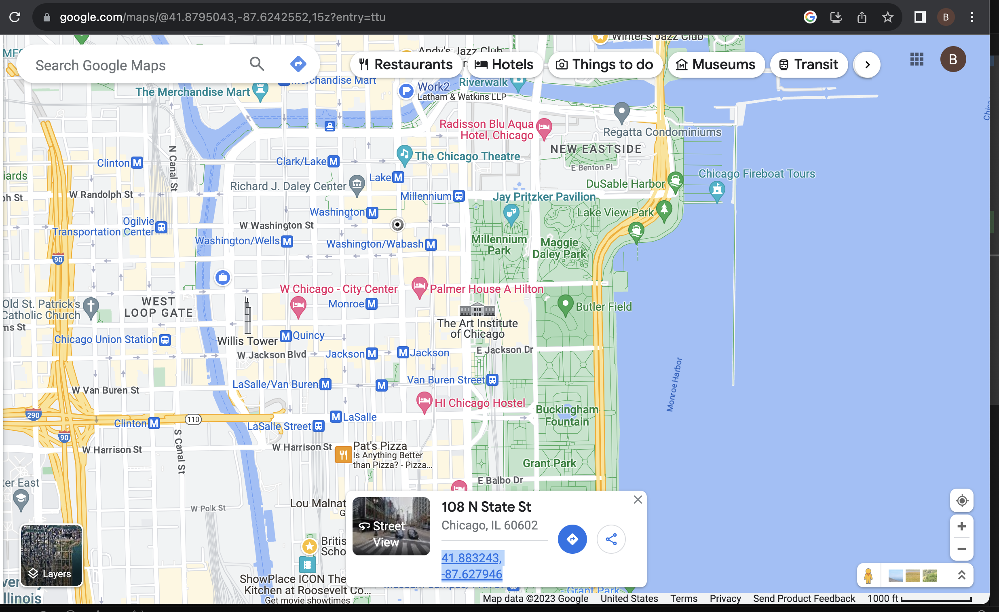

# Chicago Crime
Some python code to analyze chicago crime statistics by looking at police records 

The city of Chicago provides reported incidents of crime since 2001 (except murder) [here](https://data.cityofchicago.org/Public-Safety/Crimes-2001-to-Present/ijzp-q8t2). I use 2022 and 2023's data for this analysis.

Another useful link is [this](https://data.cityofchicago.org/Public-Safety/Boundaries-Police-Beats-current-/aerh-rz74), which gives a map of police districts and beats.

An explanation of crime code used in the data is [here](https://gis.chicagopolice.org/pages/crime_details)

# Functionalities
You can select a neigborhood by specifying a latitude, a longitude, and a radius. Then various statistics and visualizations of the police recorded crimes in the neighborhood in the past 2 years are generated. 

# Usage
Drop a pin on google map to get the (latitude, longitude) of the location of interest. Call `CrimeAnalyzer.select_area(latitude, longitude, radius)` to lock in the area. Then call `CrimeAnalyzer.get_report` to see the local report. See `example.ipynb` for an example.

